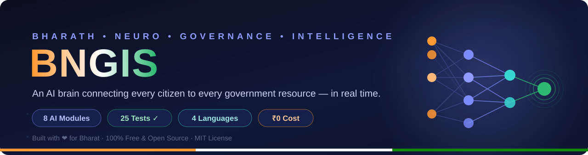

<div align="center">



# 🇮🇳 Bharath Neuro-Governance Intelligence System

**AI-Powered Real-Time Democratic Governance & Public Resource Optimization Platform**

</div>

[](https://github.com/joyboyzz/BNGIS-AI-Governance/actions/workflows/ci.yml)


> "An AI brain that connects every citizen's need to every government resource in real time — eliminating corruption, delays and inefficiency automatically."

Working MVP of the full BNGIS specification, implementing **8 of 10 modules** as a live, demoable product.

---

## ✨ What's inside

| Module | Implementation | Status |
|---|---|---|
| **Module 1** — Citizen Neural Profile Engine | Privacy-first citizen profile → 10-dimensional need vector + 5 one-click demo personas | ✅ MVP |
| **Module 2** — Resource Optimization Cortex (ROC) | Mysuru facility network (hospitals/schools/water): haversine distance, allocation score = 0.55·proximity + 0.30·availability + 0.15·quality, **automatic reroute advisories** for overloaded facilities, live SVG network map | ✅ MVP |
| **Module 3** — Scheme Matching & Delivery Engine (SMDE) | Vector similarity + hard constraints + priority scoring (35/25/20/10/10) + knapsack portfolio optimization with conflict rules, over **21 real schemes** (Central + Karnataka) | ✅ MVP |
| **Module 4** — Corruption Detection Shield (CDS) | Benford's Law χ² test · robust z-score anomalies · vendor HHI concentration · temporal patterns (threshold-splitting, weekend, FYE spike) · fuzzy ghost-beneficiary detection | ✅ MVP |
| **Module 5** — Disaster Response Neural Network (DRNN) | **SEIR epidemic simulator** with 4 intervention what-if scenarios, hospital-bed deficit coupling to Module 2; **flood risk scoring** for 12 Karnataka districts + AI response resource plans (shelters/tankers/medical teams) | ✅ MVP |
| **Module 7** — Transparency Blockchain (TBL) | SHA-256 hash chain (no mining/crypto), auto-records every AI action, integrity verifier + **live hacker-attack simulation** | ✅ MVP |
| **Module 8** — Citizen Voice NLP | Multilingual grievance AI (English/हिंदी/తెలుగు/ಕನ్నడ): script-based language detection, sentiment with negation handling, 9-category intent classifier, urgency scoring, P1–P4 ticketing, department auto-routing | ✅ MVP |
| **Module 10** — Public Dashboard | Real-time KPIs, hand-rolled SVG charts, **English / తెలుగు** interface | ✅ MVP |
| Module 6, 9 | Predictive governance (LSTM/Prophet forecasting), inter-department coordination | 🚀 Roadmap |

## 🖥️ Demo flow (3 minutes)

1. **Dashboard** — live KPIs, application trends, resource utilization, department corruption risk.
2. **Scheme Matching** — one-click persona (e.g. *Lakshmi, 34, rural Karnataka daily-wage worker*) → **Run AI Match** → ranked eligible schemes, optimal portfolio, yearly value estimate, "why not eligible" nearest misses. Every match is written to the blockchain.
3. **Resource Finder** — pick a Mysuru area + resource type → live network map, allocation scores, and a **reroute advisory** when the nearest hospital is overloaded (>85%).
4. **Disaster Response** — SEIR epidemic curves with 4 what-if intervention scenarios, hospital-bed deficit alert, Karnataka flood-risk table + auto-generated response plans (shelters, water tankers, medical teams).
5. **Citizen Voice AI** — type a grievance in English / हिंदी / తెలుగు / ಕನ್ನಡ (or click a sample) → language detection, sentiment, category, urgency, P1–P4 ticket, department auto-routing. Try *"राशन कार्ड के लिए दलाल 500 रुपये मांग रहा है"* → routes to **Lokayukta**.
6. **Corruption Shield** → **Run Full Audit** — 1,250+ seeded transactions, 5 departments, 5 detection layers. Deliberately injected fraud: *threshold-splitting in PWD, weekend round-amount payments in Education, fiscal-year-end spike in Water Dept, ghost beneficiaries with duplicate names*.
7. **Transparency Chain** — block explorer + **Simulate Hacker Attack** (tamper → caught by SHA-256 verification → repair).

## ▶️ Run it

```bash
cd bngis
pip install -r requirements.txt
uvicorn app.main:app --host 0.0.0.0 --port 8000
# open http://localhost:8000  |  API docs: http://localhost:8000/docs
```

Or with Docker: `docker compose up --build -d` → http://localhost:8000

Or run the test suite (25 tests):

```bash
pip install -r requirements.txt -r requirements-dev.txt
pytest tests/ -v
```

Or simply: `bash run.sh`

## 🔌 REST API

| Method | Endpoint | Description |
|---|---|---|
| GET | `/api/health` | Service health |
| GET | `/api/stats` | Dashboard KPIs + engine-computed dept risk |
| GET | `/api/schemes` | All 21 indexed schemes |
| GET | `/api/resources?lat=&lng=&type=` | Module 2: ranked facilities + reroute advisory for a location |
| GET | `/api/disaster/epidemic` | Module 5: SEIR simulation + intervention scenarios + hospital impact |
| GET | `/api/disaster/flood` | Module 5: district flood risk + AI response plans |
| POST | `/api/voice` | Module 8: multilingual grievance → sentiment/intent/urgency/ticket |
| GET | `/api/voice/samples` | Module 8: pre-analyzed sample feed + analytics |
| POST | `/api/match` | Citizen profile → ranked schemes + optimal portfolio (recorded on chain) |
| GET | `/api/corruption/analyze` | Full 5-layer corruption audit (recorded on chain) |
| GET | `/api/chain` | Latest blocks |
| POST | `/api/chain/record` | Append a decision/expenditure block |
| GET | `/api/chain/verify` | Recompute & verify chain integrity |

### Example

```bash
curl -X POST localhost:8000/api/match -H "Content-Type: application/json" \
  -d '{"age":34,"gender":"F","state":"KA","area_type":"rural",
       "income_annual":96000,"occupation":"daily_wage","caste":"sc",
       "has_girl_child":true,"is_family_head":true}'
```

## 🧠 Algorithms (the interesting part)

**Scheme matching — BNGIS-Match:** citizen & scheme vectors (10 dims) → cosine similarity → hard-constraint eligibility filter → priority score `0.35·benefit + 0.25·success + 0.20·(1/effort) + 0.10·similarity + 0.10·urgency` → greedy knapsack portfolio (effort budget 9) with mutual-exclusion rules (e.g., MUDRA vs Stand-Up India).

**Resource allocation — ROC:** haversine distance → `allocation_score = 0.55·proximity + 0.30·availability + 0.15·quality` with reroute advisory when the nearest facility runs above 85% utilization (accessibility / efficiency / quality constraints from the spec).

**Corruption detection — 5 layers:** Benford's Law first-digit χ² (df=8, α=1%) · robust z-score outliers (`0.6745·(x−med)/MAD`) · vendor concentration (HHI) · temporal patterns · SequenceMatcher fuzzy duplicate beneficiaries (≥86%) — with **adaptive baseline-excess scoring** so only deviation from department baseline counts as risk.

**Blockchain:** `SHA-256(index, timestamp, type, data, prev_hash, nonce)` chained; tamper detection by full-chain recomputation.

## 📁 Structure

```
bngis/
├── app/
│   ├── main.py                  # FastAPI server + REST API
│   ├── data/schemes.json        # 21 real schemes with eligibility rules
│   └── engines/
│       ├── scheme_matcher.py    # Module 3 (BNGIS-Match)
│       ├── resources.py         # Module 2 (allocation + reroute)
│       ├── corruption.py        # Module 4 (5 layers)
│       ├── blockchain.py        # Module 7 (hash chain)
│       └── stats.py             # Module 10 (dashboard)
├── static/
│   ├── index.html               # SPA shell
│   ├── css/style.css            # dark tricolor theme
│   └── js/app.js                # router + SVG charts + i18n (EN/TE)
├── docs/PROJECT_REPORT.md       # full college report
├── requirements.txt
└── run.sh
```

## 📚 Docs
- **College report:** `docs/PROJECT_REPORT.md` (abstract, architecture, algorithms with formulas, testing, future scope, references)
- Full specification: `uploads/BNGIS.txt`

## ⚠️ Honest demo notes
- Transactions & beneficiaries are **synthetic, seeded** (deterministic) — fraud patterns deliberately injected so the detectors have something to find.
- Citizen/resource KPIs on the dashboard are simulated; **department risk, scheme matching and blockchain are computed live by the engines**.
- Scheme eligibility is simplified for demo purposes — always link to official portals (the app does).

Built with ❤️ for Bharat · 100% free & open-source stack · ₹0 cost

---

<div align="center">

## ⭐ Show your support

If this project inspires you, **star the repository** and help build the movement
to transform governance through technology.

**“Technology should serve democracy, not the other way around.”**

[](https://github.com/joyboyzz/BNGIS-AI-Governance/stargazers)

*Built with ❤️ for Bharat · MIT License · ₹0 build cost*

</div>
